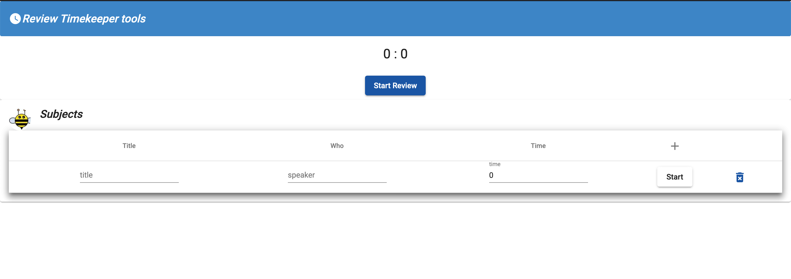

# reviewtimekeeper
Mange the time on all the review and by subjects

# The tools is under development, it's iterate and improuve time after time, if you want to collaborate don't hesitate.

## How

Add your review subjects here: 

When your are ok, start the subject

The time keeper is running

At 25% of your time subject set, the color change:

At 25% of your time subject set, the color change at red,

At the end, the tools wait 2 seconds and go back to the subjects.

### Contributor
